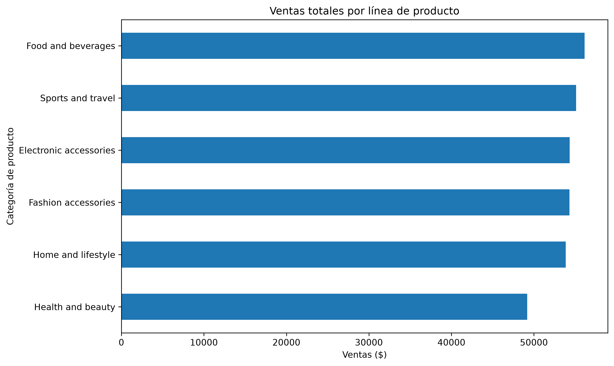
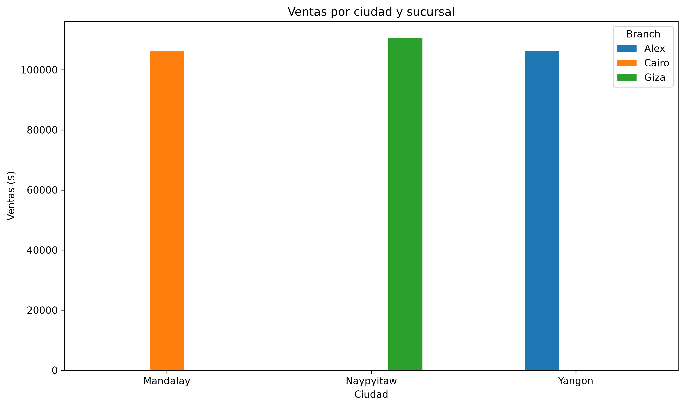
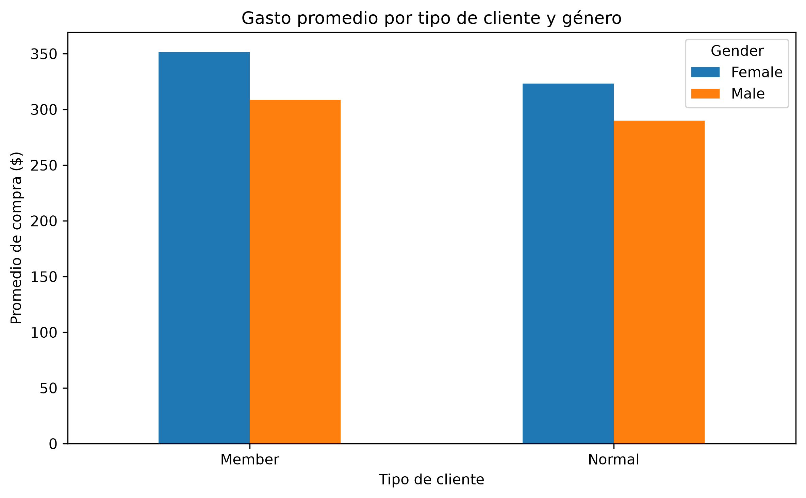
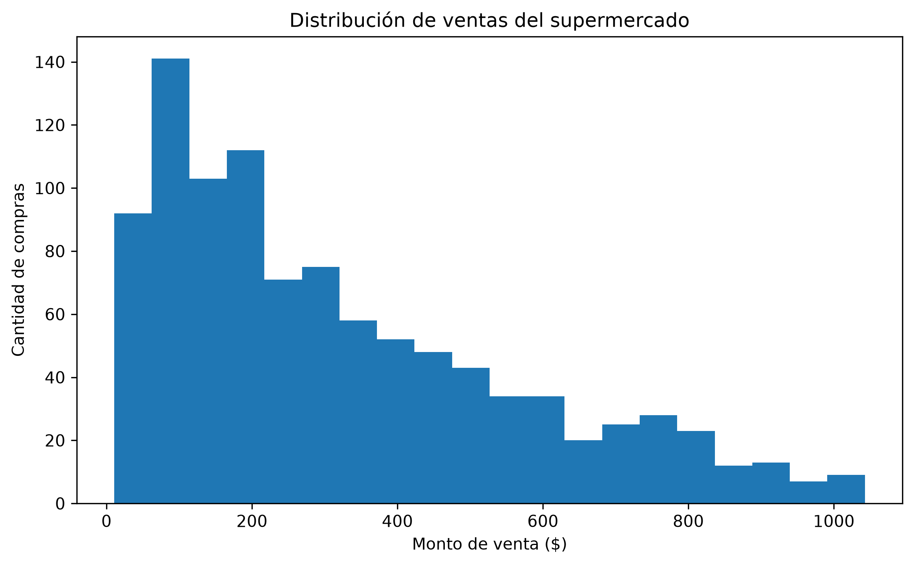
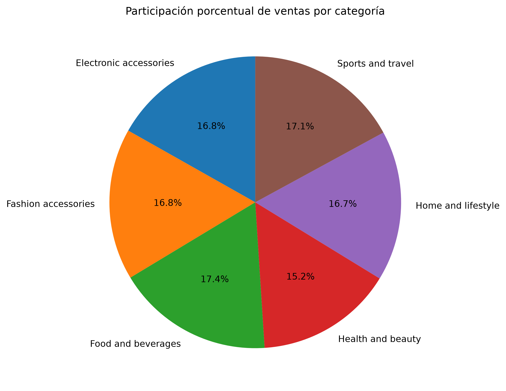

# 🛒 Analisis del Supermercado

## 📖 Descripción del proyecto

**SuperMarket Analysis** es un proyecto de análisis de datos desarrollado en Python cuyo propósito es estudiar la información de ventas de un supermercado. Mediante técnicas de limpieza, análisis exploratorio y visualización de datos, se obtienen indicadores que permiten comprender el comportamiento de los clientes, el desempeño de las sucursales y las líneas de productos con mayores ventas.

---

# 🎯 Objetivos

## Objetivo general

Analizar los datos de ventas de un supermercado para obtener información útil que facilite la toma de decisiones comerciales.

## Objetivos específicos

- Limpiar y preparar el conjunto de datos.
- Obtener estadísticas descriptivas de las principales variables.
- Analizar las ventas por sucursal y ciudad.
- Identificar las líneas de productos con mayores ingresos.
- Analizar el comportamiento de compra según el tipo de cliente y género.
- Generar gráficos que permitan visualizar los resultados de forma clara.

---

# 📂 Dataset utilizado

**Nombre del archivo**

`SuperMarket Analysis.csv`

**Características**

- 1000 registros
- 17 variables

### Variables principales

- ID de factura
- Sucursal
- Ciudad
- Tipo de cliente
- Género
- Línea de producto
- Precio unitario
- Cantidad
- Impuesto (5%)
- Ventas
- Fecha
- Hora
- Pago
- Costo de bienes vendidos (COGS)
- Porcentaje de margen bruto
- Ingreso bruto
- Valoración

---

# 👥 Integrantes

- Belén Campos
- Edgar Crespo
- Hitler Campoverde
- Adrian Lara


---

# 💻 Tecnologías utilizadas

- Python
- Pandas
- Matplotlib
- NumPy
- Jupyter Notebook
- Visual Studio Code
- Git
- GitHub

---

# 📊 Resultados

Durante el análisis se obtuvieron los siguientes resultados:

- Se calculó el resumen estadístico de las variables numéricas.
- Se obtuvo la facturación total del supermercado.
- Se calculó la ganancia bruta total.
- Se determinó el ticket promedio de compra.
- Se identificaron las líneas de productos con mayores ventas.
- Se analizaron las ventas por sucursal y ciudad.
- Se evaluó el gasto promedio según el tipo de cliente y el género.

---

# 💡 Insights

A partir del análisis de los datos se identificaron los siguientes hallazgos:

- Algunas líneas de productos generan una mayor cantidad de ingresos que otras.
- Existen diferencias en las ventas entre las distintas sucursales.
- El gasto promedio cambia según el tipo de cliente.
- La información permite identificar oportunidades para mejorar las estrategias de ventas y marketing.
- El análisis facilita la toma de decisiones basada en datos.

---

# 📈 Capturas de los gráficos

## Ventas totales por línea de producto



---

## Ventas por ciudad y sucursal



---

## Gasto por tipo de cliente y género



---

## Distribución de ventas del supermercado



---

## Participación porcentual de ventas por categoría


```
```
# ▶️ Cómo ejecutar el proyecto

## 1. Clonar el repositorio

```bash
git clone https://github.com/belencampos14/SuperMarket-Analysis.git
```

## 2. Entrar a la carpeta

```bash
cd SuperMarket-Analysis
```

## 3. Instalar las dependencias

```bash
pip install -r requirements.txt
```

## 4. Ejecutar los scripts

Limpieza de datos

```bash
python src/limpieza_datos.py
```

Análisis exploratorio

```bash
python src/analisis_exploratorio.py
```

Gráficos

```bash
python src/graficos.py
```

---

# 📁 Estructura del proyecto

```
SuperMarket-Analysis
│
├── data
│   └── SuperMarket Analysis.csv
│
├── src
│   ├── limpieza_datos.py
│   ├── analisis_exploratorio.py
│   └── graficos.py
│
├── images
│
├── requirements.txt
│
└── README.md
```

---

# ✅ Conclusión

Este proyecto demuestra cómo el análisis de datos mediante Python permite transformar información de ventas en conocimiento útil para apoyar la toma de decisiones dentro de un supermercado. Las estadísticas y visualizaciones obtenidas ayudan a comprender mejor el comportamiento de los clientes y el rendimiento del negocio.
